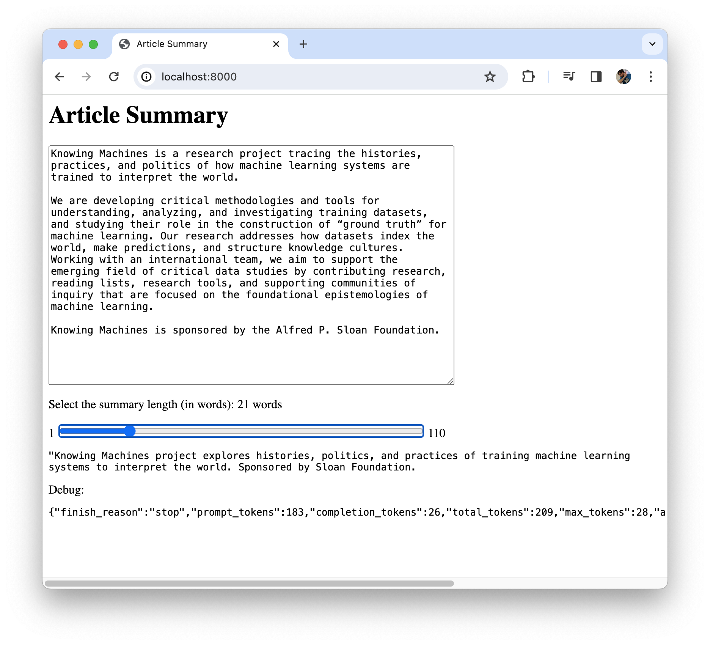

# AI-powered Article Summary

Get AI generated text summaries of various length by adjusting a slider.

Requirements:
- an [OpenAI API account](https://platform.openai.com/account/organization) & API key,
- or any text inference model, like LLama 2, running locally via [Ollama](https://ollama.ai).

## Getting started

1. Setup and start the UI with the following commands:
```
npm install
echo '{ "OPENAI": "<YOUR API KEY HERE>" }' > api-keys.json
npm start
```
2. Visit http://localhost:8000/ with your browser
3. Paste any text in the textarea
4. Drag the slider to change the length of the summary (note: the length is an aspirational word count target that text summarization models may not respect exactly)



## Architecture

```
/www/index.html                     (basic UI)
/www/index.js                       (event handlers for basic UI)
   |
   | POST text to summarize
   |    & word count requested
   v
/src/server.js                      (proxy request to AI model hosting provider)
   |
   | POST chat completion request
   v
AI model hosting provider           (e.g. OpenAI, Ollama...)
   |
   | return chat completion response
   v
/src/server.js                      (proxy response to UI)
   |
   | return summarized text
   |      & debugging statistics
   v
/www/index.js                       (update text summary in UI)
/www/index.html
```

